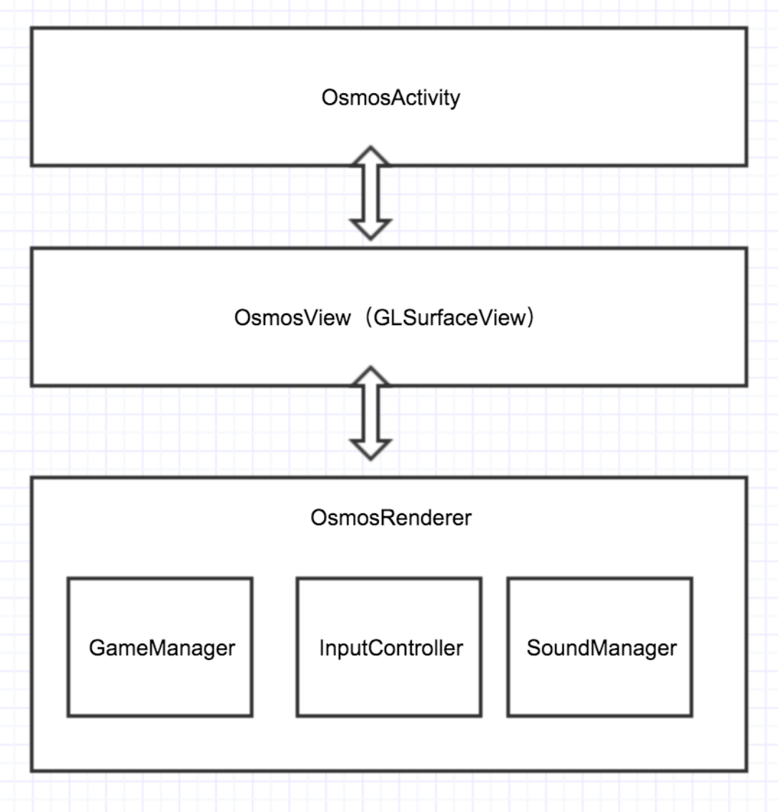
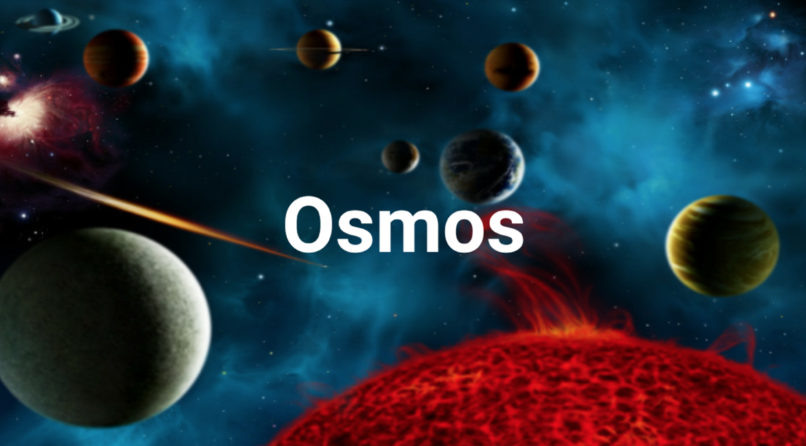
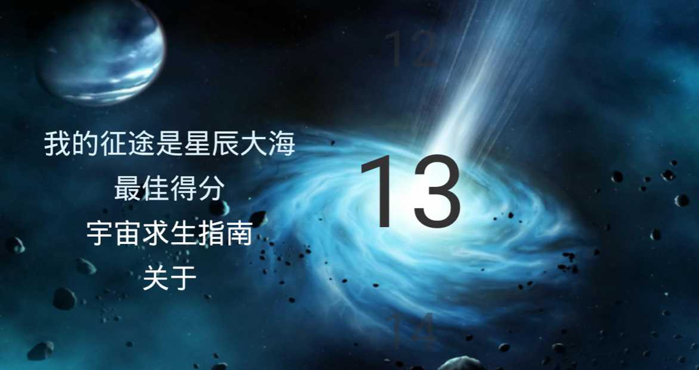
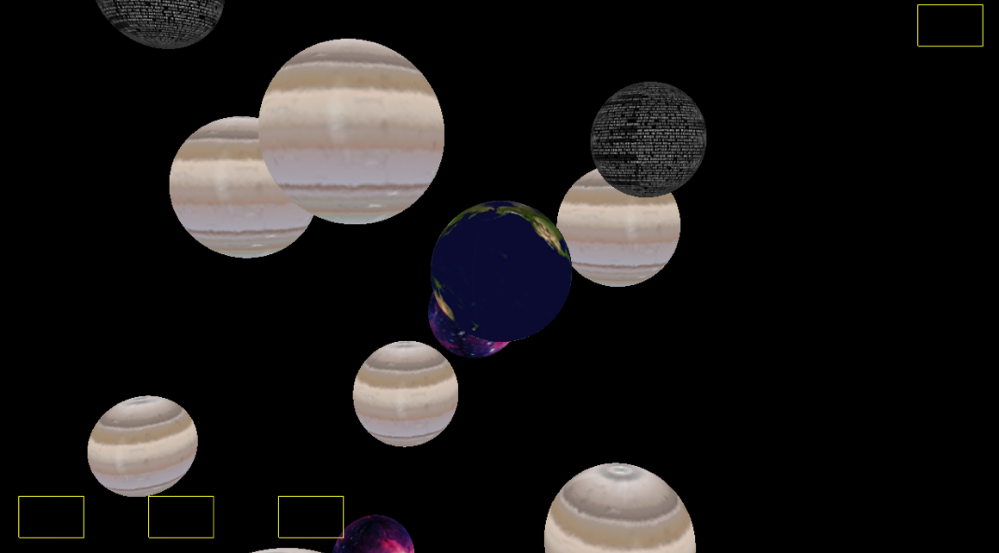

# Gl3dosmos
This is an Android game inspired by the famous game Osmos but this one is a 3D game rather than a 2D game, and it's implemented based on OpenGL ES 2.0.
Similar to Osmos, the player control a planet to survive in the space, you may need thrust to absorpt smaller planets to make yourself bigger.

##how it works

##sceenshots

